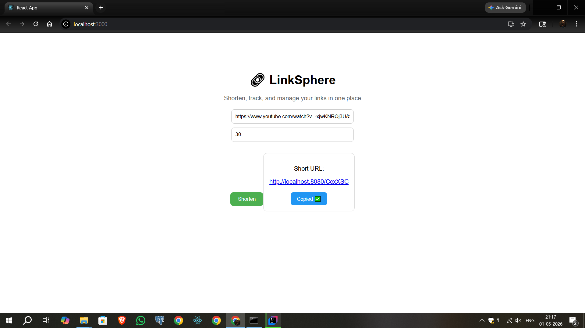

# 🔗 LinkSphere

LinkSphere is a scalable URL shortening platform that transforms long URLs into compact, shareable links with built-in analytics and expiration control.

---

## ✨ Features

* 🔗 Shorten long URLs into clean, shareable links
* ⏳ Link expiration support
* 📊 Click tracking & analytics
* 🔁 Automatic redirection to original URL
* ❌ Handles expired and invalid links gracefully
* 🌐 RESTful API design
* 📱 Frontend-ready (React integration supported)

---

## ⚙️ How It Works

1. User sends a long URL
2. System generates a unique short code
3. Short URL is returned (`/abc123`)
4. When accessed:

   * Redirects to original URL
   * Checks expiry

---

## 🛠️ Tech Stack

### Backend

* Spring Boot
* REST APIs
* Java

### Frontend

* React.js (optional integration)

### Database

* PostgreSQL

---

## 🔑 API Endpoints

### 🔗 Shorten URL

```http
POST /shorten
```

**Request Body**

```json
{
  "url": "https://example.com",
  "expiryDate": "2026-06-01T10:00:00"
}
```

**Response**

```
http://localhost:8080/abc123
```

---

### 🔁 Redirect to Original URL

```http
GET /{code}
```

* ✅ Redirects (302 FOUND)
* ❌ 404 if not found
* ⏳ 410 if expired

---

### 📊 Get Link Stats

```http
GET /stats/{code}
```

**Response Example**

```json
{
  "originalUrl": "https://google.com",
  "clickCount": 25,
  "createdAt": "2026-05-01",
  "expiryDate": "2026-06-01"
}
```

---

## 📸 Screenshots

```
## 📸 Screenshot


```

---

## ⚙️ Setup Instructions

### 1️⃣ Clone Repo

```bash
git clone https://github.com/suSha4nt/linksphere.git
cd linksphere
```

---

### 2️⃣ Run Backend

```bash
mvn clean install
mvn spring-boot:run
```

---

### 3️⃣ Run Frontend (React)

```bash
npm install
npm start
```

---

## 📂 Project Structure

```
linksphere/
│── controller/
│── service/
│── DTO/
│── frontend/
│── screenshots/
│── README.md
```

---

## 🧠 Key Design Highlights

* Service layer handles:

  * Expiry validation
  * Click tracking
* Clean separation of concerns (Controller → Service)
* Proper HTTP status usage:

  * 302 → Redirect
  * 404 → Not Found
  * 410 → Expired

---

## 🎯 Future Enhancements

* 🔐 User authentication (JWT)
* 🎨 Custom short URLs (aliases)
* 📊 Advanced analytics dashboard
* 🌍 Deploy with custom domain
* 🚀 Rate limiting for abuse prevention

---

## 👨‍💻 Author
# Susanta
GitHub: https://github.com/suSha4nt
